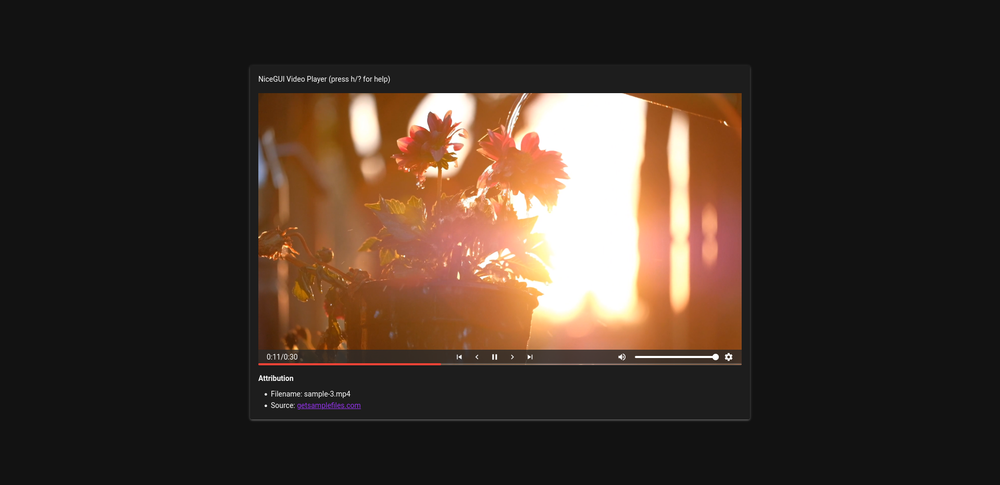

# Sample NiceGUI Video Player

This is just an experiment on how to create a video player with [NiceGUI](https://github.com/zauberzeug/nicegui).

This code is only there to provide a starting point if you need a Video Player that is a bit more beautiful than the plain HTML5 player. So hack yourself into this project and create something even more beautiful.

Also, be happy that I did all the stuff to make the interactions with the video element possible. It was damn annoying. 

### Contribute

Still, the interaction with that slider kinda buggy. I'd like to move the slider somewhere and make the video jump to that timestamp. It works partially. Respective line in the code:

```python
position = ui.slider(min=0, max=await get_video_duration(), value=0).classes("position-progress cursor-pointer").props("selection-color=red thumb-size=0 dense").on("click", lambda: video.seek(position.value))
```

Also, clicking on the video to toggle playback does not work due to some fancy errors in `vue.global.prod.js`. Just add `.on("click", lambda: notify("clicked"))` to the video element to reproduce it. The error is the following: `Error: Permission denied to access property "toJSON"`.

Just check the code. There are some commented `video.on` calls that also cause that error. Play around with it and if you work it out, I'll be happy to test and merge.
This would also allow us to use `onmousedown`, `onmouseup` to automatically hide and show the controls when hovering over the video or the video container.


### How to use
In the media folder is a copyrightfree video with the following attribution:<br>
Filename: sample-3.mp4<br>
Source: [getsamplefiles.com](https://getsamplefiles.com/sample-video-files/mp4)

Start the app by simply calling `python3 app.py`